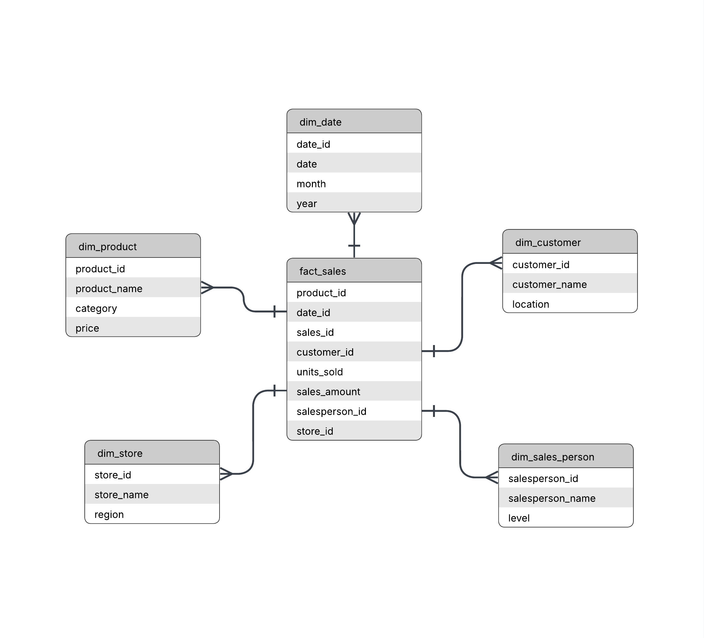
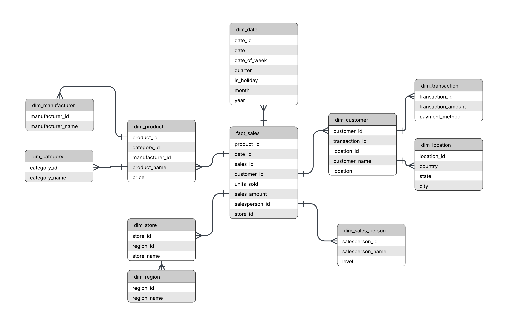

# Products sold Schema Star and Snowflake


This project is about design and the implementation using SQL od product sold, where a customer buy a product that is sol to sales person.

## Motivation / Motivacion 

EN

Starting from the simple concept of product sales system, I designed and implemented two data models, a start and a snowflake schema to compare their structural and practical diferences.

---

ES

A partir de la idea de un sistema sencillo de venta de productos, disenhar e implementar dos modelos de datos: de estrella y copo de nieve, con el objetivo de comparar las diferencias estructurales.


## Project Structure / Estructura del proyecto


| File | Description (EN) | Descripción (ES) |
|------|------------------|------------------|
| productsold_snowflake.png | Snowflake schema diagram | Diagrama del modelo copo de nieve |
| productssold_start.png | Star schema diagram | Diagrama del modelo estrella |
| snowflake.sql | Snowflake SQL script | Script SQL del modelo copo de nieve |
| start.sql | Star SQL script | Script SQL del modelo estrella |
| README.md | Project documentation | Documentación del proyecto |


## Architecture / Arquitectura

EN

In this project I created two versions of the same idea: a simple product-sales system modeled using a **star schema** and a **snowflake schema**.  
Both represent exactly the same business logic, but the structure of the dimensions changes depending on the approach.

- **Star Schema:**  
  This version is more straightforward. The dimensions connect directly to the fact table, so the model is easier to read and queries usually need fewer joins.

  

- **Snowflake Schema:**  
  In this version, some dimensions are split into smaller related tables.  
  It’s a more normalized structure, which reduces redundancy, but means the queries require more joins.

  

My goal with both models is to compare how the design, normalization level and query complexity change depending on the schema used.

---

ES

En este proyecto creé dos versiones de la misma idea: un sistema sencillo de ventas de productos usando un **esquema estrella** y un **esquema copo de nieve**.  
Ambos representan la misma lógica de negocio, pero la forma en que se organizan las dimensiones cambia según el enfoque.

- **Esquema Estrella:**  
  Esta versión es más directa. Las dimensiones se conectan a la tabla de hechos sin dividirse, así que el modelo es más fácil de entender y las consultas suelen necesitar menos joins.

  

- **Esquema Copo de Nieve:**  
  Aquí, algunas dimensiones se dividen en tablas más pequeñas relacionadas entre sí.  
  Es un modelo más normalizado, con menos redundancia, pero que requiere más joins a la hora de consultar.

  

La idea de tener ambas versiones es comparar cómo cambia el diseño, la normalización y la complejidad de las consultas según el tipo de esquema.

## How to run the project / Cómo ejecutar el proyecto

```bash
mysql -u root -p < start.sql
mysql -u root -p < snowflake.sql
```

  
